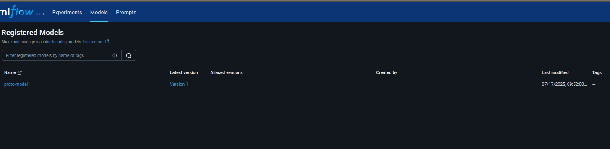

# MLFlowTutorial

## MLflow Tracking
Tracking logs everything about the model training session to be reviewed 
and compared later. Each time a training script is run, a "mlrun" in MLflow 
is created. This is analogous to an entry in a lab notebook.

We should see the following things logged:
* _Parameters_: Save the hyperparameters used in the run (eg. `C`)
* _Metrics_: Save the performance results of the model (like `accuracy`)
* _Artifacts_: Save the output file, most importantly, the trained model itself

### Run Experiments
* Run with default parameters
    `python train.py`
* Run with a variation to the C value
    `python train.py --C 0.5`
* Run with a different max_iter value
    `python train.py --max_iter 300`

### Check out the MLflow UI
```bash
mlflow ui
```

## MLflow Projects
An MLproject is a convention for packaging code to make it reproducible.
It specifies the environment and entry points for running the code.
This allows anyone to run the training with a single command.

### Run the MLproject Locally
This command tells MLflow to run the project using your *currently activated* 
local virtual environment (`.venv`), rather than trying to create a new one. This is
a robust and fast way to run projects locally, as it avoids potential issues
with MLflow locating a specific Conda installation on your system.

`mlflow run . --experiment-name "Iris-Project-Runs" --env-manager=local`

## MLflow Model Registry
The Model Registry is a centralized hub to manage the versioning of your models. You can 
manually test out your models with the UI on the Model Registry's UI.

### Register the Model
Run the training script. Use the `--register-model-name` flag.
This logs the model as an artifact and creates `Version 1` of the model in
the registry under the `iris-classifier` name.

#### Example:
1) Register the model version:
```
python train.py \--C 0.37 --max_iter 134 --register-model-name proto-model1
```

2) Go to the MLflow UI
```bash 
mlflow ui
```

3) You can promote the model (In the example above we call it `proto-model1`) to production. Note that we are on the 
`Models` tab on the top.



Clicking into the `proto-model1` model, then the corresponding most updated version, you can promote your model with
the `Promote model` button at the top right. Go through the UI to tinker with the registered model as you wish.

4) Test the served model with the `predict.py` script. 
```
python predict.py
```